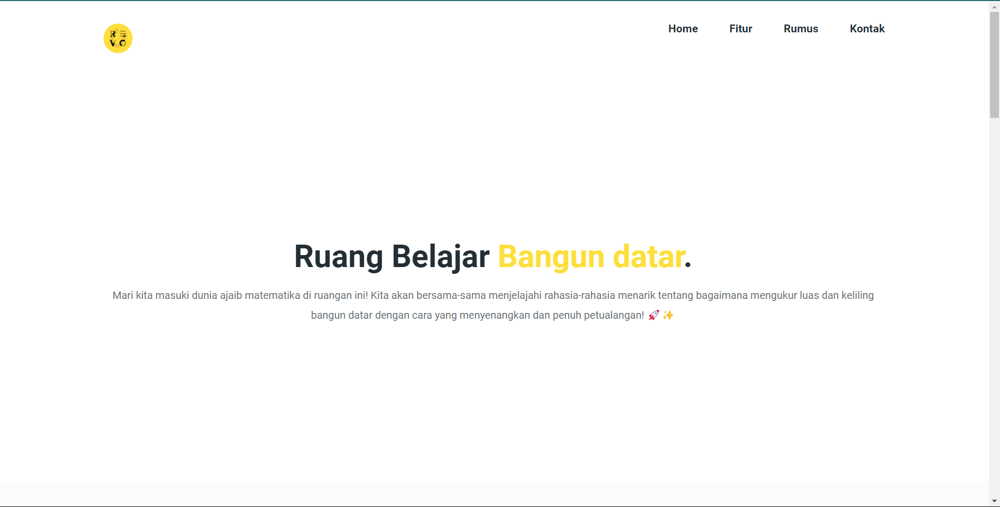

# Ruang Belajar.

## Deskripsi Website

Website ini dikembangkan sebagai bagian dari tugas Revo U Fundamental Course untuk menghitung luas dan keliling persegi. Website sederhana ini memungkinkan pengguna memasukkan nilai panjang sisi persegi dan langsung menghitung luas dan kelilingnya.

> [LIVE DEMO](https://revou-fundamental-course.github.io/8-jan-24-fachry-15.github.io/)



## Fitur Website

- Penghitungan Cepat
  Kami memberikan fitur menghitung untuk luas dan keliling sebuah bangun datar dengan lebih mudah dan cepat
- Penjelasan Informatif
  Disetiap rumus yang diberikan akan kami letakan penjabaran rumus dan data yang detail sehingga mempermudah pengguna
- Tampilan Interaktif
  Kami menciptakan pembelajaran yang interaktif guna mewujudkan sausana belajar yang tidak membosankan

## Panduan Penggunaan

Jika Anda tertarik untuk berkontribusi atau mengembangkan aplikasi lebih lanjut, berikut adalah panduan singkat:

```sh
git clone https://github.com/revou-fundamental-course/8-jan-24-fachry-15.github.io.git
cd 8-jan-24-fachry-15.github.io
```

# Kontak Saya

Jika Anda memiliki pertanyaan atau ingin berkomunikasi lebih lanjut, silakan hubungi saya [Fachry Rizky Prasetya](https://www.linkedin.com/in/fachry-rizky-065b741a2/)
